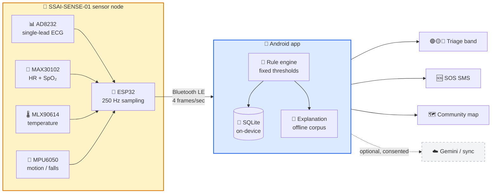
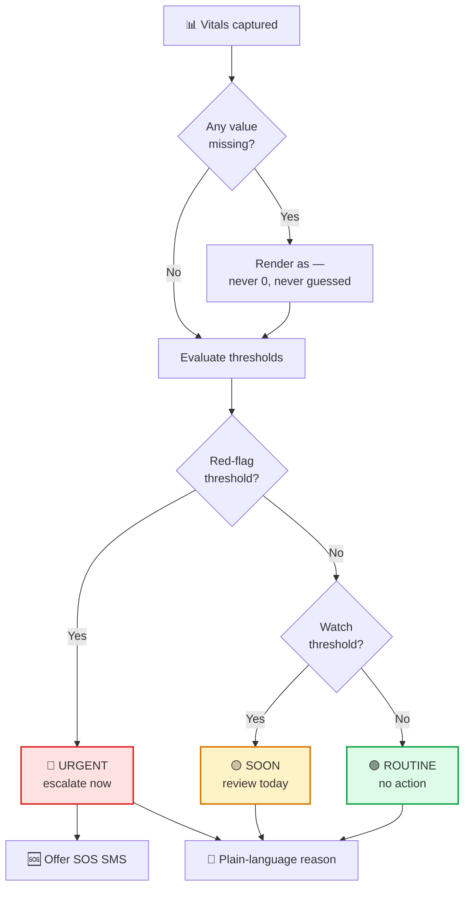
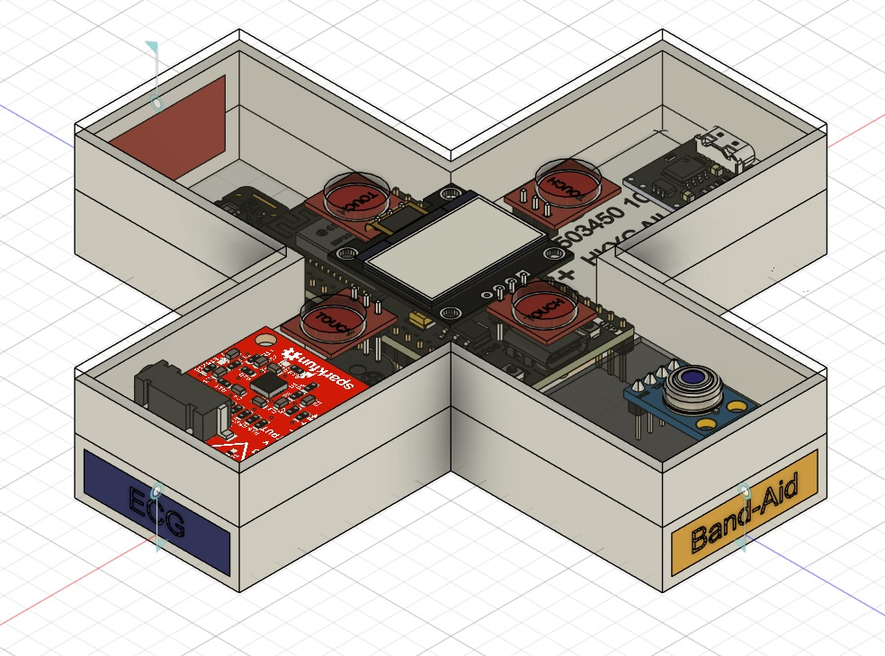
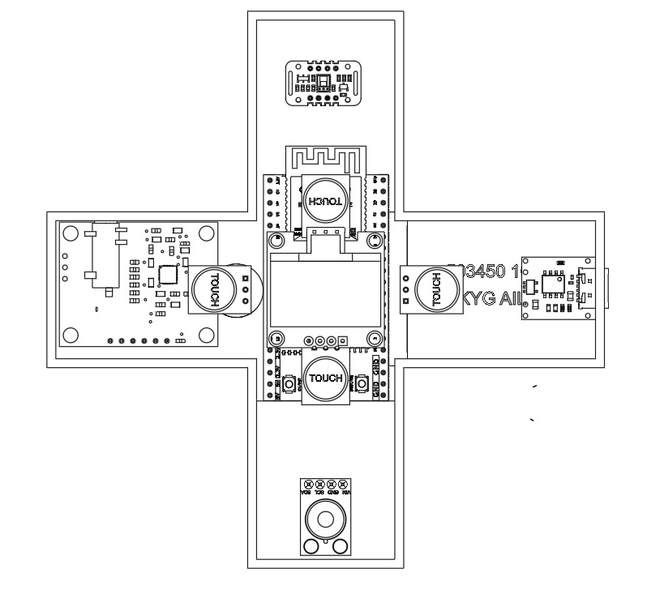
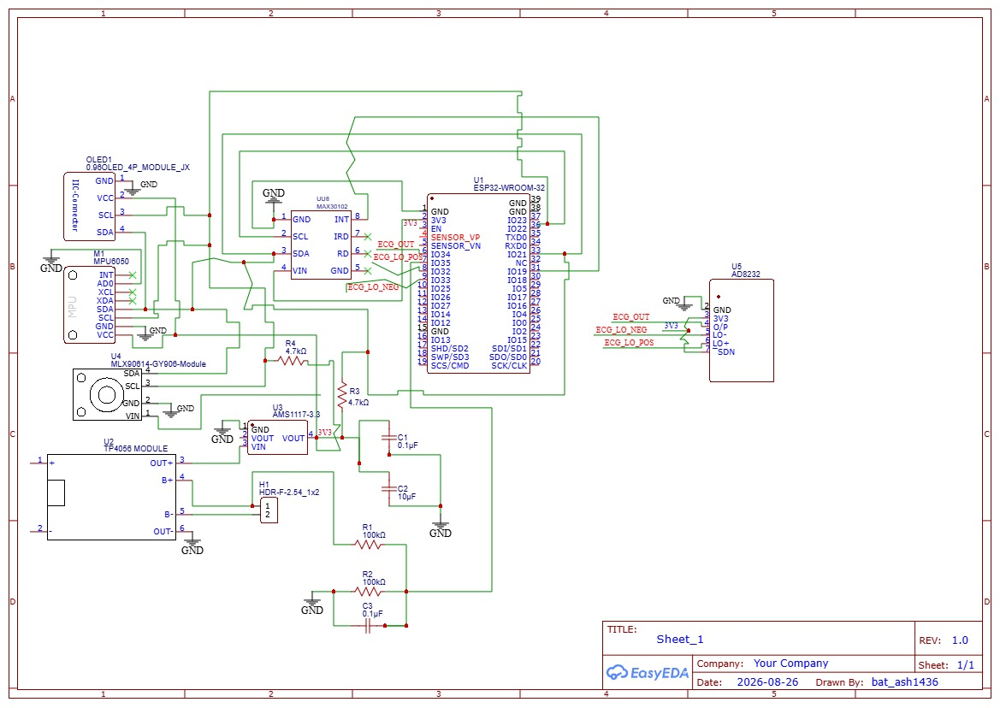

<div align="center">

# 🏥 SwasthyaSetu AI

### *Offline-first health screening for community health workers*

**Record vitals → Get triage → Understand in plain language → Act fast**
<br>*…with no internet, no cloud account, and no silent guessing.*

<br>


<br>

[](../../releases/latest)
[](#-the-hardware)
[](#-product-design)
[](#%EF%B8%8F-build-it-yourself)

<br>


</div>

---

## 📖 Contents

<table>
<tr>
<td valign="top" width="33%">

**Get Started**
- [📥 Download &amp; Install](#-download--install)
- [🎬 What It Does](#-what-it-does)
- [🔄 How It Works](#-how-it-works)

</td>
<td valign="top" width="33%">

**The Product**
- [🎨 Product Design](#-product-design)
- [🔧 The Hardware](#-the-hardware)
- [⚡ The Circuit](#-the-circuit)
- [🔌 Flash the Firmware](#-flash-the-firmware)

</td>
<td valign="top" width="33%">

**For Developers**
- [🏗️ Build It Yourself](#%EF%B8%8F-build-it-yourself)
- [💻 Laptop Dashboard](#-laptop-dashboard)
- [📂 Project Structure](#-project-structure)
- [🛡️ Permissions](#%EF%B8%8F-permissions--all-optional)

</td>
</tr>
</table>

---

## 📥 Download &amp; Install

> ### ⬇️ **[Get the latest APK from Releases →](../../releases/latest)**

<div align="center">

| | APK | Size | Architecture | Use this if… |
|:--:|-----|:----:|--------------|--------------|
| 🆕 | **`app-debug.apk`** | ~__APKSIZE__ | Universal (all) | **← Start here. Newest build, works on every phone.** |
| ⚡ | `app-release-arm64.apk` | ~32 MB | 64-bit ARM only | You want the smallest download (most phones since 2018) |
| 📦 | `app-release.apk` | ~74 MB | Universal (all) | Fallback if the above misbehaves |

</div>

<details>
<summary><b>🚀 Step-by-step install (no computer needed) — click to expand</b></summary>

<br>

1. **Open** the [Releases page](../../releases/latest) **on your Android phone**
2. **Tap** `app-debug.apk` to download it
3. Open the downloaded file → Android shows *"For your security, your phone is not allowed to install unknown apps from this source"*
4. Tap **Settings** → enable **Allow from this source** → back → **Install**
5. **Open** the app → grant permissions when prompted — **every one of them is optional**

**Uninstall an older copy first** if you previously installed a different build — Android refuses to replace an APK that was signed with a different key.

</details>

<details>
<summary><b>⚠️ Two honest warnings — please read</b></summary>

<br>

| | Warning | What it means |
|:--:|---------|---------------|
| 🔓 | **Debug-signed build** | Android will warn about an "unverified developer". That is expected for a field/hackathon build distributed outside the Play Store — it is not a sign of tampering, but you should only install APKs from this repo's Releases page. |
| 🧪 | **No sensor board = demo mode** | A phone by itself **cannot** measure heart rate, SpO₂, or ECG. Without the SSAI-SENSE-01 board the app generates *simulated* readings and stamps every one of them with a `🧪 DEMO` badge. Demo data can never be re-labelled as real. |

</details>

---

## 🎬 What It Does

<div align="center">

| Feature | Description | Offline? |
|---------|-------------|:--------:|
| 🩺 **Screening** | Heart rate, SpO₂, temperature and single-lead ECG over Bluetooth LE | ✅ |
| 🎯 **Triage** | Deterministic rule engine → **🟢 Routine / 🟡 Soon / 🔴 Urgent** + escalation level | ✅ |
| 💬 **Explanation** | Two tiers — *"Explained offline"* (bundled corpus) or *"Explained online"* (Gemini). Always labelled which one you got. | ✅ / 🌐 |
| 👥 **Patients** | Multiple profiles, full screening history, local SQLite | ✅ |
| 🆘 **Emergency SOS** | Composes an SMS with the triage result + location (if consented) and opens your messaging app | ✅ |
| 📉 **Fall detection** | Phone accelerometer, plus the board's MPU6050 IMU when connected | ✅ |
| 🗺️ **Offline map** | Real OpenStreetMap raster tiles bundled as MBTiles — country-level context with zero data | ✅ |
| 📈 **30-day trends** | Per-patient baselines for HR / SpO₂ / temp with deviation highlighting | ✅ |
| 🌡️ **Environment alerts** | Heat &amp; air-quality advisories from Open-Meteo (no API key needed) | 🌐 |
| ☁️ **Sync** | Optional, consent-gated upload — **off** unless you turn it on | 🌐 |

</div>

---

## 🔄 How It Works



<details>
<summary><b>🎯 How triage decides — click to expand</b></summary>

<br>

The rule engine is **deterministic**: the same vitals always produce the same band. There is no model inference in the triage path, so a result can always be traced back to a threshold.



</details>

---

## 🎨 Product Design

The sensor node lives in a custom **cross-shaped 3D-printed enclosure**. The shape is functional, not decorative: the arms separate the ECG electrode pads from the PPG/temperature window so a health worker cannot accidentally cover the wrong sensor, and the flat top face carries the OLED.

<div align="center">

<table>
<tr>
<th width="50%">🧊 3D enclosure — isometric render</th>
<th width="50%">📐 Enclosure layout — top view</th>
</tr>
<tr>
<td width="50%"></td>
<td width="50%"></td>
</tr>
<tr>
<td width="50%"><i>Cross-shaped shell, printed in two halves.</i></td>
<td width="50%"><i>Arm faces are labelled <b>ECG</b> and <b>Band-Aid</b> so electrode placement is unambiguous in the field.</i></td>
</tr>
</table>

</div>

<details>
<summary><b>📁 Design source files</b></summary>

<br>

| File | What it is |
|------|------------|
| [`hardware/design/3d-enclosure-render.jpg`](hardware/design/3d-enclosure-render.jpg) | Isometric render of the assembled enclosure |
| [`hardware/design/enclosure-layout-top.jpg`](hardware/design/enclosure-layout-top.jpg) | Top-down layout with labelled sensor arms |
| [`hardware/design/circuit-schematic.jpg`](hardware/design/circuit-schematic.jpg) | Full electrical schematic (EasyEDA) |
| [`hardware/hardware-schematic.svg`](hardware/hardware-schematic.svg) | Simplified wiring diagram |
| [`hardware/HARDWARE.md`](hardware/HARDWARE.md) | Assembly notes and bring-up procedure |

</details>

---

## 🔧 The Hardware

Real vitals require the sensor node. Without it the app still runs — in clearly labelled demo mode.

<div align="center">

| | Component | Job | Interface |
|:--:|-----------|-----|-----------|
| 📡 | **ESP32-WROOM-32** | Main MCU — sampling, R-peak detection, BLE | — |
| 📊 | **AD8232** | Single-lead ECG front end | Analog → ADC1 |
| 💓 | **MAX30102** | Pulse oximetry (HR + SpO₂) | I²C |
| 🌡️ | **MLX90614** *(GY-906)* | Contactless body temperature | I²C |
| 🤸 | **MPU6050** | 6-axis IMU — fall detection | I²C |
| 🖥️ | **SSD1306 OLED** 0.96″ | On-device readout | I²C `0x3C` |
| 👆 | **TTP223** | Capacitive touch — start a reading | Digital (active-LOW) |
| 🔋 | **TP4056** | Li-Po charge management | — |
| ⚡ | **AMS1117-3.3** | 3.3 V regulation | — |

</div>

<details>
<summary><b>📌 Pin map — exactly as wired</b></summary>

<br>

These values are taken from [`firmware/SSAI_SENSE_01/SSAI_SENSE_01.ino`](firmware/SSAI_SENSE_01/SSAI_SENSE_01.ino), which is the source of truth.

| ESP32 pin | Connected to | Notes |
|-----------|--------------|-------|
| `GPIO36` (VP / ADC1_CH0) | AD8232 **OUTPUT** | Analog ECG, sampled at 250 Hz |
| `GPIO39` (VN) | AD8232 **LO+** | Lead-off detect |
| `GPIO34` | AD8232 **LO−** | Lead-off detect |
| `GPIO18` | AD8232 **SDN** | Driven HIGH = front end enabled |
| `GPIO4` | TTP223 touch OUT | **Active LOW** (idle HIGH) |
| `GPIO21` / `GPIO22` | OLED SDA / SCL | I²C bus, display at `0x3C` |
| `GPIO35` | Battery divider | `BAT+ —100 kΩ— GPIO35 —100 kΩ— GND` |
| `GPIO2` | Built-in blue LED | Status patterns |

**Signal chain:** ECG sampled at **250 Hz**, batched **8 samples per BLE frame**, telemetry pushed every **250 ms** (4 frames/sec). Battery is read once a second and mapped 3.0 V → 4.2 V.

</details>

<details>
<summary><b>📡 BLE contract</b></summary>

<br>

| Property | Value |
|----------|-------|
| Service UUID | `6e400001-b5a3-f393-e0a9-e50e24dcca9e` |
| Discovery | The app scans **by service UUID**, not by device name |
| Link state | Surfaced honestly as *scanning → connecting → connected → lost* |
| Verification | The in-app **diagnostics screen** measures the *actual* achieved sample rate, not the advertised one |

</details>

> ### ⚠️ Electrical safety
> **Never take an ECG reading while the board is plugged into a charger.** Run on battery or power-bank only when electrodes are in contact with skin.

---

## ⚡ The Circuit

<div align="center">

<a href="hardware/design/circuit-schematic.jpg">

</a>

<i>Click the schematic to open it full-size.</i>

</div>

<details>
<summary><b>🔍 Reading the schematic</b></summary>

<br>

| Block | What to look for |
|-------|------------------|
| **Power** | `TP4056` charges the Li-Po cell; `AMS1117-3.3` drops it to the 3.3 V rail that feeds every sensor. Decoupling caps (0.1 µF / 10 µF) sit at each rail entry. |
| **Battery sense** | Two 100 kΩ resistors form a ÷2 divider into `GPIO35` — the ESP32 ADC cannot see 4.2 V directly. |
| **I²C bus** | `MAX30102`, `MLX90614`, `MPU6050` and the OLED all share SDA/SCL with 4.7 kΩ pull-ups. |
| **ECG front end** | `AD8232` output goes to `GPIO36`; its lead-off detect pair goes to `GPIO39` / `GPIO34`; `SDN` on `GPIO18` lets firmware power the analog front end down. |

Drawn in **EasyEDA** — see [`hardware/design/circuit-schematic.jpg`](hardware/design/circuit-schematic.jpg).

</details>

---

## 🔌 Flash the Firmware

<details open>
<summary><b>Arduino IDE, four steps</b></summary>

<br>

1. Install the **Arduino IDE**, then add ESP32 board support (*esp32* by Espressif, 3.x)
2. Install libraries: **Adafruit SSD1306** and **Adafruit GFX**
3. Open [`firmware/SSAI_SENSE_01/SSAI_SENSE_01.ino`](firmware/SSAI_SENSE_01/SSAI_SENSE_01.ino) → select board **DOIT ESP32 DEVKIT V1** → **Upload**
4. On boot the OLED runs a short self-test, then **tap the touch pad** — live HR, scrolling ECG trace, signal-quality bar and battery appear, and BLE starts advertising exactly as the app expects

The live loop contains **no blocking delays**: the OLED animation, R-peak detection and BLE notifications all run off the same non-blocking scheduler, so the ECG trace never stalls while the display updates.

</details>

---

## 💻 Laptop Dashboard

No phone handy? [`tools/ecg_dashboard.html`](tools/ecg_dashboard.html) is a single self-contained file — **no install, no server, no build step**.

Open it in **Chrome** or **Edge** → click **Connect** → pick the ESP32 over **Web Bluetooth** → live ECG strip and vitals render in the browser. Ideal for demos and 30-second hardware sanity checks.

---

## 🏗️ Build It Yourself

```bash
# Prerequisites: Flutter 3.9+ SDK, Android SDK (via Android Studio)
git clone https://github.com/krishnendukoley2007-arch/swasthyasetu-ai.git
cd swasthyasetu-ai

flutter pub get      # 📦 install dependencies
flutter test         # ✅ 428 tests — all should pass
flutter build apk --debug   # 📱 → build/app/outputs/flutter-apk/app-debug.apk
```

<details>
<summary><b>📦 Other build targets</b></summary>

<br>

```bash
# Smaller, per-architecture release APKs
flutter build apk --release --split-per-abi

# Run straight onto a connected device
flutter run --release
```

</details>

<details>
<summary><b>🔑 Optional: enable online AI explanations</b></summary>

<br>

```bash
# Compile-time (bakes the key into the APK)
flutter build apk --release --dart-define=GEMINI_API_KEY=your_key_here
```

Or at runtime: **Settings → AI → paste your Google AI Studio key**.

**No key is committed to this repository, and no key is required to build or run the app** — without one, explanations come from the bundled offline corpus and are labelled as such.

</details>

<details>
<summary><b>🗺️ Optional: a better offline map</b></summary>

<br>

- **Bundled:** `assets/map/india_lowzoom.mbtiles` (~690 KB, zoom 0–6)
- **Add detail:** drop any `.mbtiles` file into the device's `map_tiles` folder
- Imported packs take priority, and the map caption always names the active source
- Generator script: `tool/build_map_pack.py`

</details>

---

## 🛡️ Permissions — All Optional

Nothing is mandatory. Every denial has a defined, non-crashing consequence.

<div align="center">

| Permission | Why it's asked | If you deny it |
|------------|----------------|----------------|
| 🔵 **Bluetooth / Nearby devices** | Connect to the sensor board | Vitals stay in demo mode |
| 📍 **Location** | Geotag screenings for the community map | Map disabled; screenings still save, without coordinates |
| 🌐 **Internet** | Online AI explanations, optional sync | Everything else works; offline explanations are used |
| 📷 **Camera** | Scan patient / device QR codes | Enter details by hand |
| ⚙️ **Foreground service** | Keep BLE alive during a reading | The session may drop if you switch apps |

</div>

> 🔒 **Location consent is OFF by default.** When it's off the map *says so* rather than rendering empty terrain and letting you assume there's no data.

---

## 📂 Project Structure

<details>
<summary><b>Click to expand the tree</b></summary>

<br>

```
lib/
├── core/        🔧 Services (BLE, SMS/SOS, storage, sync, MBTiles), theme, routing, providers
├── data/        💾 Drift/SQLite database, repositories, row mappers
├── domain/      🧠 Models + the deterministic triage rule engine
├── features/    🎯 Per-screen modules — dashboard, patients, screening,
│                   history, emergency, community, settings
└── l10n/        🌐 app_en.arb / app_hi.arb / app_bn.arb — all UI strings

test/            🧪 428 tests (2.0× font-scale overflow, offline-map honesty, triage rules…)
firmware/        🔌 SSAI_SENSE_01 — ESP32 sketch: ECG, touch, OLED, battery, BLE
tools/           💻 ecg_dashboard.html — Web-Bluetooth live ECG viewer
hardware/
├── design/      🎨 3D enclosure renders + circuit schematic
├── HARDWARE.md  📖 Assembly and bring-up notes
└── *.svg        📐 Wiring diagram
assets/
├── guidelines/  📚 Offline explanation corpus
├── map/         🗺️ Bundled OSM tile pack
└── fonts/       🔤 Inter — bundled so vitals never render in an OEM font
```

</details>

### 🏛️ Architecture Principles

<div align="center">

| | Principle | What it means in practice |
|:--:|-----------|---------------------------|
| 🔄 | **One-way provenance** | Data can go measured → demo-flagged, never the reverse. `isDemo` makes it structurally impossible for simulated readings to masquerade as real ones. |
| 🇬🇧 | **Storage stays English** | Only *labels* translate. The database, exports and rule engine share exactly one vocabulary, so a Bengali-language screening and an English one are the same record. |
| ❌ | **No fabricated gaps** | A missing value renders as `—`. Never `0`, never an interpolation, never a plausible-looking guess. |
| 🧪 | **Tested where it hurts** | 428 tests cover the boring failure modes: layout overflow at 2.0× font scale, map honesty when consent is off, threshold boundaries. |

</div>

---

## 📜 License &amp; Attribution

| Asset | License |
|-------|---------|
| Application code | [MIT](LICENSE) |
| Bundled map tiles | © OpenStreetMap contributors • [ODbL](https://www.openstreetmap.org/copyright) |
| Inter typeface | [SIL OFL 1.1](https://github.com/rsms/inter) |

---

## ⚠️ Medical Disclaimer

> **This software is a screening and triage-support tool for trained community health workers.**
>
> It does **not** diagnose, treat, or prescribe. Its risk bands come from **fixed threshold rules**, not clinical judgement.
>
> **Do not use it as the sole basis for a care decision. Do not use it in place of emergency services.**

---

<div align="center">

**Built for community health workers everywhere**

[🐛 Report a bug](../../issues/new) • [💡 Request a feature](../../issues/new) • [📋 Changelog](CHANGELOG.md) • [🔒 Security](SECURITY.md) • [⬇️ Releases](../../releases)

</div>
