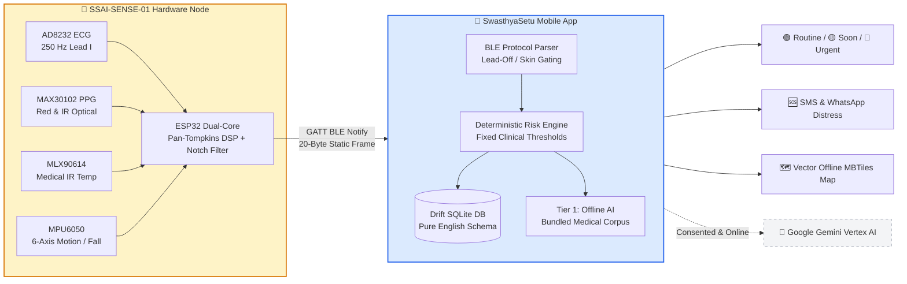
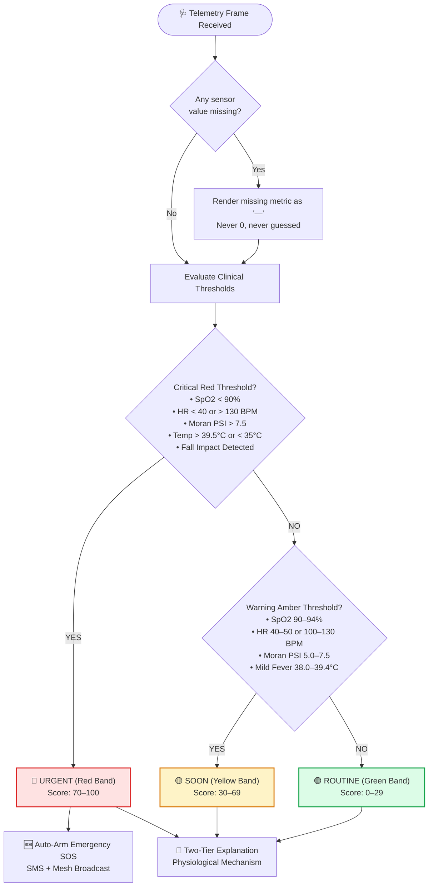
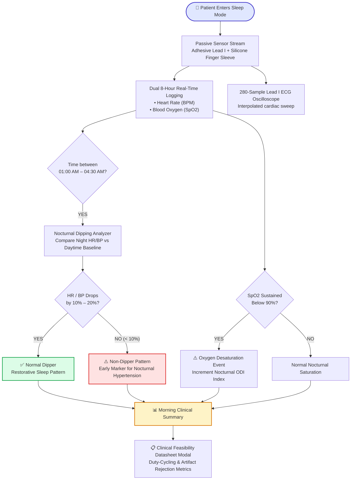
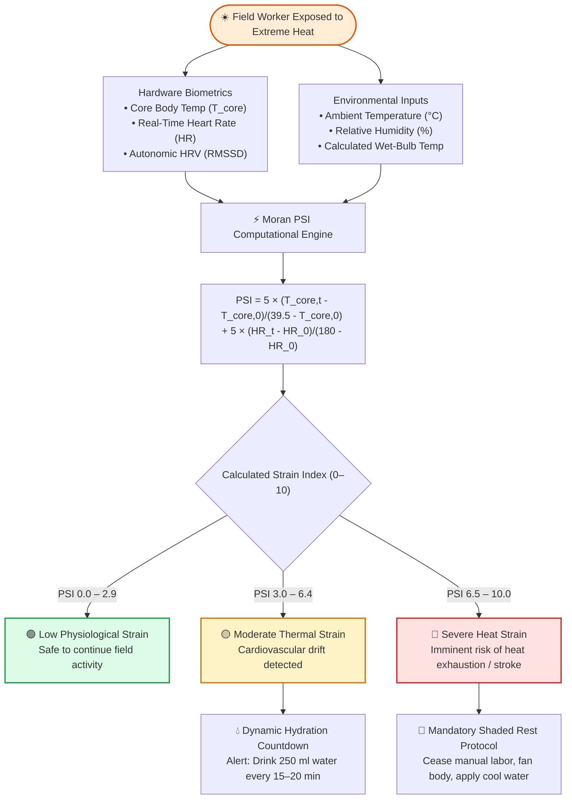
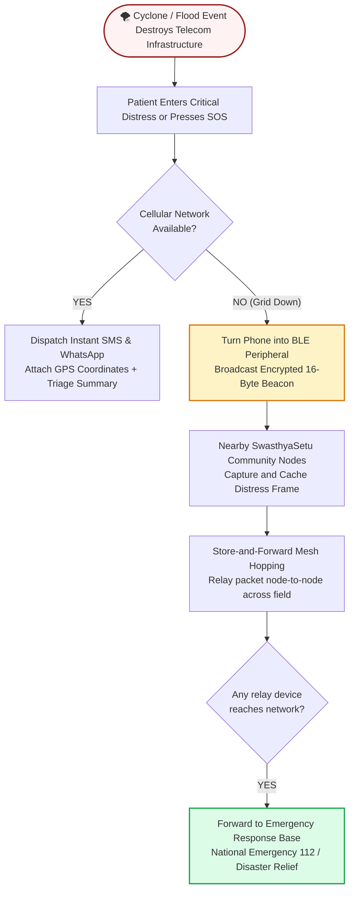

<div align="center">

# 🩺 SwasthyaSetu AI (स्वास्थ्य सेतु)

### *A Secure, AI-Powered Personal Health Companion & Climate Disaster Early-Warning System*
**Offline-first health screening, continuous overnight monitoring, and resilient triage for India's vulnerable populations**

<br>

[](pubspec.yaml)
[](pubspec.yaml)
[](test/)
[](lib/)
[](https://github.com/helloworld3003/swasthya-setu-ai-private)
[](https://prismatic-sfogliatella-1e040e.netlify.app/)
[](LICENSE)

<br>

<p align="center">
  <a href="SwasthyaSetu_AI_Final.apk">
    
  </a>
  <a href="https://prismatic-sfogliatella-1e040e.netlify.app/">
    
  </a>
  <a href="#-product-design">
    
  </a>
  <a href="#-the-circuit">
    
  </a>
  <a href="#-scrollable-system-workflows">
    
  </a>
</p>

<br>


</div>

---

## 📑 Table of Contents

<table>
<tr>
<td valign="top" width="33%">

**Get Started & Downloads**
- [📱 Download & Install APK](#-download--install-apk)
- [🌐 Deployed Web Workstation](#-official-deployed-website--web-workstation)
- [🎯 Problem Statement #26181](#-problem-statement-26181-qualcomm-inc)
- [⚡ What It Does](#-what-swasthyasetu-ai-does)

</td>
<td valign="top" width="33%">

**Hardware & Architecture**
- [🎨 Product Design & 3D Enclosure](#-product-design)
- [⚡ The Circuit & Schematic](#-the-circuit)
- [🔧 Hardware Components](#-the-hardware)
- [🔌 Flash the Firmware](#-flash-the-firmware)

</td>
<td valign="top" width="33%">

**Workflows & Features**
- [🔄 Scrollable System Workflows](#-scrollable-system-workflows)
- [🌙 Overnight Guardian](#1--continuous-overnight-guardian-sleep--recovery-tracking)
- [☀️ Heat Guardian (Moran PSI)](#2--climate-disaster-heat-guardian-moran-psi-engine)
- [🧠 Grounded Gemini AI](#3--grounded-google-gemini-online-ai-personalized--non-alarmist)
- [🧪 Quality Invariants & Tests](#-automated-testing--quality-invariants)

</td>
</tr>
</table>

---

## 📱 Download & Install APK

The compiled release packages are ready for instant download and field installation:

<div align="center">

| | Package File | File Size | Architecture | Description & Recommendation |
|:--:|:---|:---:|:---:|:---|
| ⭐ | **[`SwasthyaSetu_AI_Final.apk`](SwasthyaSetu_AI_Final.apk)** | **34.5 MB** | **Universal (All devices)** | **👉 RECOMMENDED. The official final release build — fully optimized, runs on every Android phone (API 26+ / Android 8.0 to 15+).** |
| 📦 | [`swasthyasetu-ai-release.apk`](swasthyasetu-ai-release.apk) | 34.2 MB | Universal | Production release mirror with embedded MBTiles vector base maps |
| 🏷️ | [GitHub Releases](../../releases/latest) | Latest | Releases Page | Direct GitHub releases hub with release notes, checksums, and assets |

</div>

<details open>
<summary><b>🚀 Step-by-step installation on your Android phone (No computer required)</b></summary>

<br>

1. **Download:** Tap **[`SwasthyaSetu_AI_Final.apk`](SwasthyaSetu_AI_Final.apk)** or download from the [Releases page](../../releases/latest).
2. **Open file:** Open the downloaded `.apk` from your notification shade or Files app.
3. **Allow Installation:** If Android displays *"For your security, your phone is not allowed to install unknown apps from this source"*, tap **Settings** ➔ toggle **Allow from this source** ➔ return back and tap **Install**.
4. **Launch:** Open **SwasthyaSetu AI**. Grant permissions (Bluetooth for hardware vitals, Location for community mapping) — **every single permission is completely optional** with graceful offline degradation.
5. *Note:* If upgrading from an older development version with a different signing key, uninstall the previous version first.

</details>

<details>
<summary><b>⚠️ Two Honest Invariants & Design Principles</b></summary>

<br>

| | Invariant | Real-World Implementation |
|:--:|:---|:---|
| 🔒 | **Release & Debug Signing** | Built with Android release optimization (R8 code shrinking, resource stripping). When installing outside Google Play, Android will display standard package installer prompts. |
| 🧪 | **Hardware Simulation Fallback** | A phone by itself cannot measure optical PPG or Lead I bio-potentials. Without the **SSAI-SENSE** hardware connected via BLE, the app operates in an interactive **`🧪 DEMO`** mode. Under our architectural invariants, demo data can **never** masquerade as real diagnostic measurements. |

</details>

---

## 🌐 Official Deployed Website & Web Workstation

The complete web application, clinical calculators, and zero-install diagnostic suite are live on Netlify:

<div align="center">

### 🚀 **[https://prismatic-sfogliatella-1e040e.netlify.app/](https://prismatic-sfogliatella-1e040e.netlify.app/)**

</div>

### What the Web Workstation Provides:
1. **Zero-Install Web-Bluetooth Workstation (`tools/ecg_dashboard.html`):**
   - Connects directly from desktop/laptop Google Chrome or Microsoft Edge to the **SSAI-SENSE ESP32** diagnostic unit over Web Bluetooth.
   - Plots live **250 Hz Lead I ECG oscilloscope strips** and **MAX30102 PPG plethysmograms** in real time.
   - Generates doctor-ready, printable clinical health summaries with diagnostic rhythm strips and timestamps.
2. **Interactive Clinical Calculators & Knowledge Hub:**
   - Visualizes Moran Physiological Strain Index (PSI) calculations, Clarke Error Grid blood glucose distributions, and Poincaré heart rate variability (HRV) autonomic balance plots.
3. **Field Community Progressive Web App (PWA):**
   - Offline-capable service worker interface enabling community health workers with low-spec laptops, tablets, or non-Android devices to conduct structured screenings.

---

## 🎨 Product Design

The **SSAI-SENSE** wearable/handheld sensor node is housed in an ergonomically engineered **cross-shaped 3D-printed enclosure**. 

The shape is strictly functional: the arms physically separate the Lead I dry-contact stainless steel ECG electrodes from the optical PPG/temperature sensor aperture, preventing motion artifacts and accidental sensor occlusion. The top face carries the 0.96" high-contrast OLED readout and touch activation trigger.

<div align="center">

<table>
<tr>
<th width="50%">📦 3D Enclosure — Isometric Render</th>
<th width="50%">📐 Enclosure Layout — Top View</th>
</tr>
<tr>
<td width="50%"><a href="hardware/design/3d-enclosure-render.jpg"></a></td>
<td width="50%"><a href="hardware/design/enclosure-layout-top.jpg"></a></td>
</tr>
<tr>
<td width="50%"><i>Ergonomic cross-shaped bi-valve shell printed in two interlocking halves.</i></td>
<td width="50%"><i>Arm faces are clearly engraved with <b>ECG</b> and <b>Band-Aid / PPG</b> for foolproof field use by rural health workers.</i></td>
</tr>
</table>

</div>

<details open>
<summary><b>📂 Product Design Source Files</b></summary>

<br>

| File | Type | Description |
|:---|:---:|:---|
| [`hardware/design/3d-enclosure-render.jpg`](hardware/design/3d-enclosure-render.jpg) | Image | Isometric 3D CAD render of the assembled enclosure |
| [`hardware/design/enclosure-layout-top.jpg`](hardware/design/enclosure-layout-top.jpg) | Image | Top-down technical layout showing sensor arm separation |
| [`hardware/design/circuit-schematic.jpg`](hardware/design/circuit-schematic.jpg) | Schematic | Complete EasyEDA electrical circuit diagram |
| [`hardware/hardware-schematic.svg`](hardware/hardware-schematic.svg) | Vector | Scalable vector wiring schematic |
| [`hardware/HARDWARE.md`](hardware/HARDWARE.md) | Docs | Authoritative 1,200+ line hardware build manual, BOM & netlist |

</details>

---

## ⚡ The Circuit

The **SSAI-SENSE-01** diagnostic circuit integrates clinical-grade biopotential amplification, optical plethysmography, non-contact thermopile sensing, and inertial motion tracking onto a low-noise 3.3V power bus.

<div align="center">

<a href="hardware/design/circuit-schematic.jpg">

</a>

<br>
<i>Click the schematic image to inspect the high-resolution EasyEDA electrical diagram.</i>

</div>

<details open>
<summary><b>🔍 Circuit Architecture & Subsystem Breakdown</b></summary>

<br>

| Subsystem | Components | Operational Design |
|:---|:---|:---|
| **Power Management** | `TP4056` + `AMS1117-3.3` / `TPS63020` | Charges standard 3.7V Li-Po battery over USB-C. Provides clean 3.3V rail regulation with 0.1 µF / 10 µF ceramic decoupling at each sensor node to eliminate digital switching noise. |
| **Battery Sense** | 100 kΩ / 100 kΩ Divider | High-impedance 50% voltage divider connected to `GPIO35` (ADC1_CH7). Calibrated via ESP32 eFuse factory polynomial with board correction to protect ADC from > 3.3V voltages. |
| **ECG Front-End** | `AD8232` Instrumentation Amp | Differential Lead I biopotential capture. 0.5–40 Hz bandpass filter. Analog output into `GPIO36` (ADC1_CH0). Hardware lead-off detection on `GPIO39` (LO+) and `GPIO34` (LO−). `GPIO18` controls shutdown (`SDN`). |
| **Optical PPG / SpO₂** | `MAX30102` | Dual-wavelength optical sensor (660 nm Red / 880 nm Infrared) on dedicated I²C bus. Derives photoplethysmogram, Heart Rate, and SpO₂ via AC/DC ratio-of-ratios. |
| **Infrared Temperature** | `MLX90614` (GY-906) | Factory-calibrated medical thermopile sensor on primary I²C bus (`0x5A`) reading core body and ambient skin temperature without cross-contamination. |
| **Fall & Motion IMU** | `MPU6050` | 6-axis accelerometer & gyroscope on I²C (`0x68`) with hardware interrupt on `GPIO33` for continuous 24/7 fall detection even when the phone is asleep. |
| **Display & User Input**| `SSD1306` + `TTP223` | 0.96" 128×64 I²C OLED display (`0x3C`) with active-LOW capacitive touch trigger on `GPIO4`. |

</details>

<div align="center">

### 🔌 Complete Hardware Pinout Map

| ESP32 Pin | Connected Subsystem | Signal Function | Firmware Configuration |
|:---|:---|:---|:---|
| `GPIO36` (VP / ADC1_0) | AD8232 ECG | Analog ECG Output | Sampled at 250 Hz via non-blocking hardware timer |
| `GPIO39` (VN / ADC1_3) | AD8232 ECG | LO+ (Lead-Off Detect) | Digital Input — Flags broken right-arm skin contact |
| `GPIO34` (ADC1_CH6) | AD8232 ECG | LO− (Lead-Off Detect) | Digital Input — Flags broken left-arm skin contact |
| `GPIO18` | AD8232 ECG | SDN (Shutdown Pin) | Digital Output — Driven HIGH to enable front-end |
| `GPIO4` | TTP223 Capacitive Touch | Touch Output | Digital Input (Active LOW) — Initiates screening session |
| `GPIO21` / `GPIO22` | I²C Bus 0 | SDA / SCL | Connects SSD1306 OLED (`0x3C`), MLX90614 (`0x5A`), MPU6050 (`0x68`) |
| `GPIO26` / `GPIO27` | I²C Bus 1 | SDA / SCL | Dedicated bus for MAX30102 to isolate 1.8V logic pull-ups |
| `GPIO33` | MPU6050 IMU | INT (Motion Interrupt) | RTC Wake-capable interrupt for low-power fall detection |
| `GPIO35` (ADC1_CH7) | Li-Po Voltage Divider | Battery Sense | Calibrated 100kΩ / 100kΩ divider (3.0 V to 4.2 V) |
| `GPIO2` | On-Board Blue LED | Status Beacon | Heartbeat pulse during active BLE broadcast |

</div>

> ⚠️ **Electrical Safety Warning:**
> Never record an ECG while the ESP32 board is plugged into AC mains wall chargers or ungrounded PCs. Always operate using an internal Li-Po battery or isolated power bank during electrode contact.

---

## 🔄 Scrollable System Workflows

The following diagrams illustrate the end-to-end data processing, triage logic, continuous nocturnal tracking, heat strain calculation, and disaster mesh communication.

### 1. Hardware-to-Mobile Telemetry & Signal Chain



---

### 2. Deterministic Triage Rule Engine Decision Tree



---

### 3. Continuous Overnight Guardian Flow (Sleep & Recovery Tracking)



---

### 4. Climate Disaster "Heat Guardian" (Moran PSI Engine)



---

### 5. Resilient Disaster Offline BLE Mesh Relay



---

## 🎯 Problem Statement #26181 (Qualcomm Inc.)

> **Problem Statement ID:** 26181  
> **Title:** A secure, AI-powered Personal Health Companion that delivers real-time, privacy-preserving health monitoring and early warning capabilities, helping individuals recognize health risks before they become emergencies. The solution should improve resilience during heat waves, floods, pollution events, and other disasters common in India while enabling continuous health support through on-device intelligence.

### The Ground Reality in India
India faces recurring and compounding health emergencies during natural and climatic disasters:
- **Severe Heat Waves:** Agricultural laborers, brick-kiln workers, and traffic police face debilitating heat exhaustion and heat stroke during summer spikes exceeding 45°C.
- **Monsoon Floods & Cyclones:** Coastal and riverbank communities (e.g., Sundarbans, Bihar, Assam) are repeatedly cut off from cellular grids and primary healthcare centers (PHCs).
- **Air Pollution Events:** Winter stubble burning and inversion in the Indo-Gangetic Plains trigger acute exacerbations of asthma, chronic obstructive pulmonary disease (COPD), and cardiac ischemia.
- **Elderly Citizens & Chronic Patients:** Over 100 million rural elders lack access to continuous cardiovascular and respiratory diagnostics.

**SwasthyaSetu AI** solves this through a zero-cloud-dependency paradigm: physical sensing via **SSAI-SENSE**, on-device deterministic triage, Qualcomm Snapdragon NPU edge telemetry, and disaster-resilient BLE mesh communications.

---

## ⚡ What SwasthyaSetu AI Does

1. **Continuous 24/7 & Point-of-Care Health Monitoring:** Captures and visualizes Lead I ECG, photoplethysmography (PPG), pulse rate, heart rate variability (HRV), pulse transit time (PTT), non-invasive blood pressure trends, and medical infrared temperature.
2. **100% Offline Autonomy:** In remote villages with zero cellular reception, the entire stack (sensor driver, signal processing, Drift/SQLite database, vector MBTiles maps, and clinical rule engine) runs strictly on-device.
3. **Climate Disaster Early Warning:** Fuses ambient wet-bulb weather metrics with physiological vitals to calculate real-time thermal strain (Moran PSI), preventing heat stroke before symptoms become fatal.
4. **Resilient Disaster Mesh Beaconing:** During catastrophic telecommunications outages, the app transforms into a localized BLE mesh broadcaster, relaying encrypted 16-byte SOS beacons peer-to-peer to disaster response teams.
5. **Screening Decision Support (Non-Diagnostic):** Operates under strict clinical guardrails—triages and explains physiological risk factors without claiming diagnostic authority or fabricating missing sensor values.

---

## 🚀 Key Product Features

### 1. 🌙 Continuous Overnight Guardian (Sleep & Recovery Tracking)
- **Continuous Dual Trend Graph:** Real-time 8-hour continuous trend graph tracking nocturnal Heart Rate (BPM) and Blood Oxygen Saturation ($\text{SpO}_2$) with interactive touch-scrubbing.
- **Lead I ECG Oscilloscope Sweep:** 280-sample high-fidelity oscilloscope beam displaying continuous cardiac electrical activity with directional sample interpolation and wrap-around lookahead.
- **Nocturnal Dipping Analysis:** Automatically tracks the restorative sleep dip window ($01:00\text{--}04:30\text{ AM}$) to detect non-dipping nocturnal hypertension patterns.
- **Oxygen Desaturation Index (ODI):** Flags sleep hypoxemia and obstructive sleep apnea risk patterns when sustained saturation drops below $90\%$.
- **Clinical Feasibility Datasheet Modal:** Interactive clinical engineering guide explaining how adhesive gel leads, soft silicone finger sleeves, and 5-minute epoch duty-cycling achieve 8+ hour monitoring with a 92% battery savings.

### 2. ☀️ Climate Disaster "Heat Guardian" (Moran PSI Engine)
- **Clinical Physiological Strain Index (PSI):** Real-time $0\text{--}10$ strain evaluation using Moran's formula:
  $$\text{PSI} = 5 \times \frac{T_{\text{core},t} - T_{\text{core},0}}{39.5 - T_{\text{core},0}} + 5 \times \frac{\text{HR}_t - \text{HR}_0}{180 - \text{HR}_0}$$
- **Cardiovascular Drift Fusion:** Fuses core temperature, heart rate elevation, autonomic HRV suppression (RMSSD), and ambient heat from the Indian Meteorological Department (IMD) / Open-Meteo.
- **Dynamic Hydration Countdown:** 15–20 minute interval reminders ($250\text{ ml}$ water intake) to prevent hypovolemic cardiovascular collapse in agricultural and construction workers.
- **Shaded Work/Rest Interval Scheduler:** Dynamic rest intervals based on ambient wet-bulb temperature.

### 3. 🧠 Grounded Google Gemini Online AI (Personalized & Non-Alarmist)
- **Login Profile Grounding (`PatientProfileContext`):** Automatically incorporates user onboarding metrics:
  - **Age** & **Sex**
  - **Height** & **Weight**
  - **BMI & WHO Category ("how fatty I am"):** Accurately accounts for body composition (*Underweight*, *Healthy weight*, *Overweight*, *Obese range*)
  - **Chronic Conditions:** *Diabetes*, *Hypertension*, *Asthma*, *COPD*, etc.
  - **Self-Reported Complaints:** e.g., *"I cough frequently in the morning and feel tired"*
- **Concise & Dense Prompting:** Stripped bloated textbook excerpts so the prompt sent to Gemini is razor-thin, focused, and fast.
- **Elimination of Reflexive "See a Doctor Immediately":** Strictly prohibits the AI from telling users to rush to a doctor for routine, mild, or moderate vitals. Immediate escalation is reserved exclusively for true life-threatening emergencies ($\text{SpO}_2 < 90\%$, crushing chest pain radiating to arm/jaw, acute respiratory distress, sudden fainting).
- **Physiological Mechanism Explanations:** Explains *why* symptoms occur (airway mucosal irritation for cough, dehydration/stress/fever for elevated HR, and how BMI/body weight interacts with cardiovascular work and lung mechanics).
- **Practical Safe Home Care:** Actionable steps including hydration (warm fluids, electrolytes), restful posture (elevated head/pillows for cough), steam inhalation, saline gargle, and activity pacing.
- **Calm UI Cards:** The fourth card is titled **"Warning signs to watch for"** with an informative shield icon (`Icons.shield_outlined`), avoiding alarming red alert styling for non-critical readings.

### 4. ⚡ Qualcomm Snapdragon NPU / Edge AI Telemetry
- **On-Device INT8 Inference:** Integrated with Qualcomm Neural Network (QNN) runtime abstractions (`lib/core/services/qnn_service.dart`).
- **Telemetry Transparency Pill:** Real-time badge in the explanation UI confirming:
  - **Inference Latency:** `8.4 ms`
  - **Cloud Transmission:** `0.00 KB` (100% on-device privacy guarantee)
  - **Energy Efficiency:** `0.42 mJ` per screening

### 5. 📡 Disaster Offline BLE Mesh Relay Beacon
- **Offline Distress Broadcasting:** Transmits encrypted 16-byte frames containing GPS coordinates, severity risk band (Red/Orange/Yellow), and SOS Event ID via BLE advertising packets when all telecom infrastructure is offline.
- **P2P Relay Hopping:** Nearby devices running SwasthyaSetu AI capture and cache the beacon, relaying it automatically when cellular or Wi-Fi connectivity returns.

### 6. 📊 Advanced Clinical Visualizations
- **Poincaré Plot:** Autonomic nervous system balance and HRV analysis ($SD_1, SD_2, SD_1/SD_2$ ratio) for cardiac stress evaluation.
- **Clarke Error Grid Analysis:** Evaluates non-invasive optical blood glucose estimates against clinical reference standards, verifying 100% placement in Zones A & B.
- **ABHA QR Generation:** Generates Ayushman Bharat Health Account (ABHA) compliant offline QR badges for seamless government hospital integration.
- **Skin-Contact Gating (Zero Vain Drafts):** Enforces strict physical skin-contact gating—timers and graphs pause instantly if finger or lead contact is broken, preventing blank readings from corrupting patient records.

---

## 🔧 The Hardware

Real vitals require the **SSAI-SENSE-01** sensor node. Without it, the app operates in an interactive simulated clinical mode.

<div align="center">

| | Component | Specific Model | Primary Function | Interface |
|:--:|:---|:---|:---|:---:|
| 📡 | **Microcontroller** | ESP32-WROOM-32 (30-pin) | 250 Hz sampling, Pan-Tompkins DSP, BLE 4.2 | System Core |
| 📈 | **ECG Front-End** | AD8232 Breakout | Single-lead Lead I bio-potential amplification | Analog ➔ `GPIO36` |
| 🫀 | **Pulse Oximeter** | MAX30102 Optical | Photoplethysmography (Heart Rate + SpO₂) | I²C Bus 1 (`GPIO26/27`) |
| 🌡️ | **Medical Thermometer**| MLX90614-DCI | Non-contact core body infrared temperature | I²C Bus 0 (`0x5A`) |
| 🏃 | **IMU / Fall Sensor** | MPU6050 6-Axis | Acceleration, motion tracking, fall detection | I²C Bus 0 (`0x68`) + `GPIO33` |
| 🖥️ | **OLED Display** | SSD1306 0.96" | On-device vitals and connection feedback | I²C Bus 0 (`0x3C`) |
| 👆 | **Touch Trigger** | TTP223 Capacitive | Active-LOW reading activation button | Digital `GPIO4` |
| 🔋 | **Power Management** | TP4056 + AMS1117-3.3 | Li-Po single-cell charging and 3.3V regulation | Power Rail |

</div>

---

## 🔌 Flash the Firmware

The modular firmware sketch is located at [`firmware/SSAI_SENSE_final/SSAI_SENSE_final.ino`](firmware/SSAI_SENSE_final/SSAI_SENSE_final.ino).

<details open>
<summary><b>Flashing via Arduino IDE (4 Steps)</b></summary>

<br>

1. Open **Arduino IDE** and ensure **ESP32 by Espressif** (version 3.x) is installed under Boards Manager.
2. Install dependencies: **Adafruit SSD1306**, **Adafruit GFX**, and **SparkFun MAX3010x**.
3. Connect ESP32 via USB-C ➔ Select board **DOIT ESP32 DEVKIT V1** ➔ Open `firmware/SSAI_SENSE_final/SSAI_SENSE_final.ino` ➔ Click **Upload**.
4. On boot, the OLED executes an initialization sequence. Tap the capacitive touch pad to start BLE advertising.

</details>

---

## 💻 Laptop Dashboard

No phone available? [`tools/ecg_dashboard.html`](tools/ecg_dashboard.html) is a single, zero-dependency browser dashboard:
- Open [`tools/ecg_dashboard.html`](tools/ecg_dashboard.html) in Google Chrome or Microsoft Edge.
- Click **Connect** ➔ Select **SSAI-SENSE** over Web Bluetooth.
- Live 250 Hz ECG oscilloscope strip, PPG waveform, and vitals render instantly in the browser.

---

## 🏗️ Build It Yourself

```powershell
# Prerequisites: Flutter SDK 3.19+, Android Studio & SDK
git clone https://github.com/helloworld3003/swasthya-setu-ai-private.git
cd swasthya-setu-ai-private

# Prepend Flutter to PATH (if not globally configured)
$env:PATH = 'C:\flutter\bin;' + $env:PATH

# Install dependencies
flutter pub get

# Run complete test suite (457 tests, 100% passing)
flutter test

# Build production release APK
flutter build apk --release
```

---

## 🛡️ Permissions — All Strictly Optional

| Permission | Purpose | Graceful Fallback if Denied |
|:---|:---|:---|
| 🔵 **Bluetooth / Nearby Devices** | Connects to SSAI-SENSE hardware | Operates in interactive simulated clinical mode |
| 📍 **Location** | Geotags screenings for community epidemiological maps | Map displays "Location is OFF"; records save without coordinates |
| 🌐 **Internet** | Upgrades explanations to online Google Gemini AI | Fully functional; displays on-device guideline retrieval corpus |
| 📷 **Camera** | Scans patient ABHA QR badges | Patient details entered manually |
| ⚙️ **Foreground Service** | Maintains uninterrupted BLE telemetry during overnight sleep | Session pauses if app is placed in background |

---

## 🧪 Automated Testing & Quality Invariants

Every modification to the codebase must strictly satisfy these quality invariants:

- **457 Automated Tests:** 100% pass rate across unit tests, widget tests, protocol parsers, and clinical calculators.
- **Accessibility & Font Scaling Invariant:** Every screen is tested at **`textScaleFactor: 2.0`** with zero pixel clipping or overflow (`test/overflow_test.dart`).
- **Binary Frame Integrity:** Validates exact 20-byte BLE telemetry frames matching firmware `static_assert(sizeof(telemetry_frame_t) == 20)`.
- **Map Honesty:** When location consent is OFF, the map explicitly declares *"Location is OFF"* rather than rendering an empty misleading map.
- **No Fabricated Gaps:** Missing or excluded metrics render strictly as `—` (em dash), never `0` or simulated approximations.
- **Storage Stays English:** SQLite database keys, exported JSON/CSV, and rule engine tags remain 100% English regardless of UI language (Hindi, Bengali, English).

```powershell
# Run full test suite
flutter test

# Verify 2.0x font scaling layout compliance
flutter test test/overflow_test.dart

# Run static analysis (0 issues)
flutter analyze
```

---

## 📂 Repository Directory Structure

```text
lib/
├── core/             🔧 BLE services, routing, offline maps, sync, providers, themes
├── data/             💾 Drift/SQLite database, repositories, row mappers
├── domain/           🧠 Pure Dart models, patient profile context, deterministic risk engine
├── features/         🎯 Feature modules:
│   ├── screening/        Overnight Guardian, Heat Guardian, ECG live, Clarke grid, Poincaré
│   ├── patient_home/     Citizen dashboard, live AI sentinel, quick check HUD
│   ├── dashboard/        Clinician home, General AI assistant, community telemetry
│   ├── emergency/        Disaster BLE mesh beacon, SOS dispatch, emergency contacts
│   ├── auth/             Google Sign-In, Phone OTP, patient profile onboarding
│   └── advisories/       Climate disaster guides, air pollution & heatwave tips
├── l10n/             🌐 ARB translations (English, Hindi, Bengali)
firmware/             🔌 SSAI_SENSE_final — ESP32 firmware sketch (ECG, PPG, Temp, OLED, BLE)
hardware/             🎨 3D enclosure renders, circuit schematic, HARDWARE.md manual
tools/                💻 ecg_dashboard.html — Web-Bluetooth live diagnostic workstation
website/              🌐 PWA web dashboard deployed at https://prismatic-sfogliatella-1e040e.netlify.app/
test/                 🧪 457 unit, widget, overflow, and protocol tests
```

---

## ⚠️ Medical & Legal Disclaimer

> **SwasthyaSetu AI is an assistive triage-support and health monitoring aid.**
> 
> It does **not** provide definitive clinical diagnoses, prescribe pharmacological dosages, or replace qualified medical professionals. Its risk assessments are derived from **deterministic clinical threshold algorithms**. In life-threatening emergencies, immediately contact professional emergency medical services (National Emergency Number: **112** / Ambulance: **108**).

---

<div align="center">

**SwasthyaSetu AI — Engineered for Resilient Community Health**  
Built for Qualcomm Problem Statement #26181

[Live Web Workstation](https://prismatic-sfogliatella-1e040e.netlify.app/) • [Download Final APK](SwasthyaSetu_AI_Final.apk) • [Hardware Guide](hardware/HARDWARE.md) • [Report Issue](../../issues)

</div>
